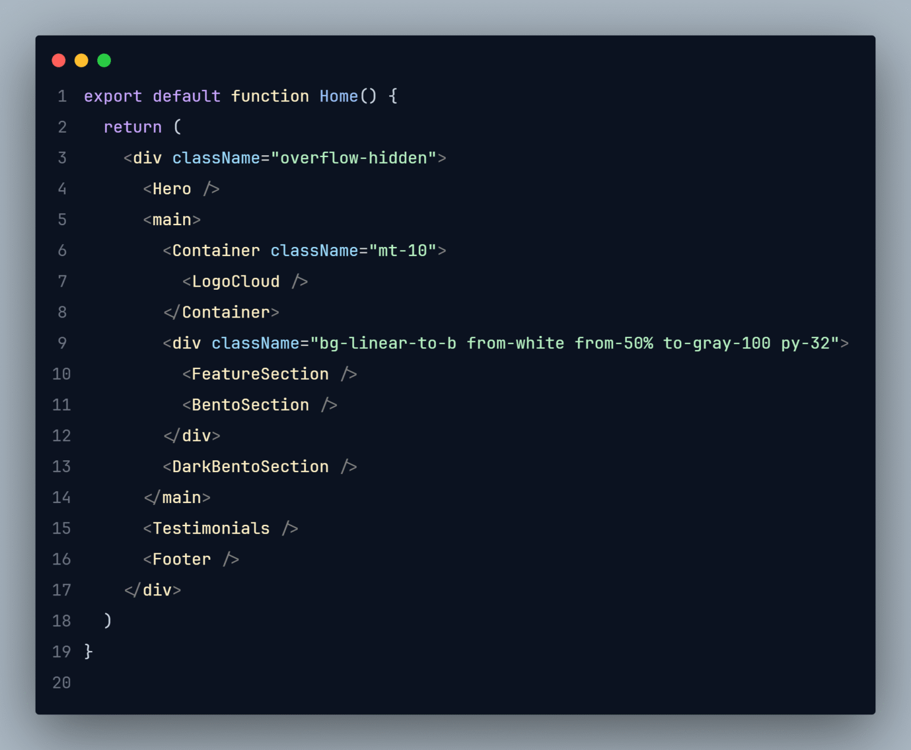

# Wpstorm Pastel Theme 🌈

A soft and modern pastel color theme for Visual Studio Code, inspired by Wpstorm Pastel.
Designed to be easy on the eyes and fun to code with!

[](https://marketplace.visualstudio.com/items?itemName=WpstormGenius.wpstorm-pastel-theme)
[](https://marketplace.visualstudio.com/items?itemName=WpstormGenius.wpstorm-pastel-theme)
[](LICENSE)
[](https://github.com/esradev/Wpstorm-Pastel-Theme)

---

## 🎨 Features

- Pastel colors for a modern, calm coding experience
- Works on both **dark and light modes**
- High readability for all common programming languages
- Minimalistic, soft UI elements that reduce eye strain

---

## 🖼️ Preview

> _(Add a screenshot or GIF of your theme here for the Marketplace)_



---

## ⚡ Installation

1. Open VS Code and go to the **Extensions** sidebar (`Ctrl+Shift+X`)
2. Search for **Wpstorm Pastel Theme**
3. Click **Install**
4. Activate it via **File → Preferences → Color Theme → Wpstorm Pastel Theme**

---

## 💡 Recommended Settings

```json
{
  "workbench.colorTheme": "Wpstorm Pastel Theme"
}
```

## 🔗 Recommended Extensions

To get the best experience with **Wpstorm Pastel Theme**, we recommend installing these extensions:

- **[Wpstorm Pastel Icons](https://marketplace.visualstudio.com/items?itemName=WpstormGenius.wpstorm-pastel-icons)**
  Complements the theme with soft pastel file and folder icons. Perfect for a cohesive look.

> Tip: Combining **Wpstorm Pastel Theme** with **Wpstorm Pastel Icons** is highly recommended for a fully harmonious coding environment!
